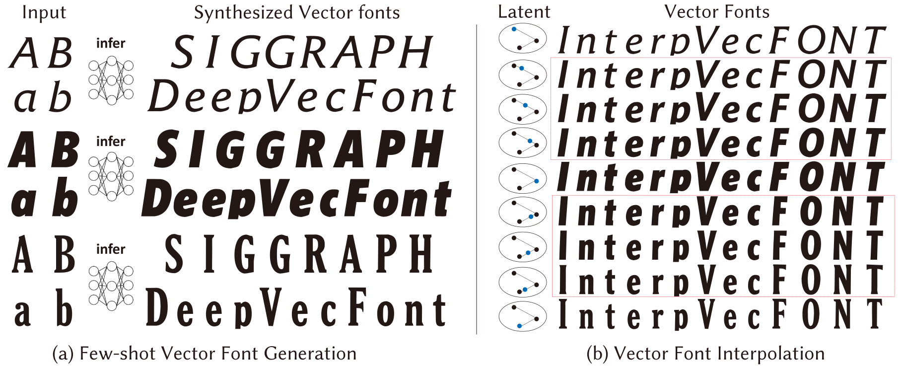

# DeepVecFont
This is the homepage for SIGGRAPH 2021 Technical paper "DeepVecFont: Synthesizing High-quality Vector Fonts via Dual-modality Learning".
Authors: [Yizhi Wang](https://yizhiwang96.github.io/) and [Zhouhui Lian](https://www.icst.pku.edu.cn/zlian/). WICT, Peking University.
Paper: to be published soon
Code: [GitHub](https://github.com/yizhiwang96/deepvecfont)
Video: [link]()

## Introduction

## Abstract
Automatic font generation based on deep learning has aroused a lot of interest in the last decade. However, only a few recently-reported approaches are capable of directly generating vector glyphs and their results are still far from satisfactory. In this paper, we propose a novel method, DeepVecFont, to effectively resolve this problem. Using our method, for the first time, visually-pleasing vector glyphs whose quality and compactness are both comparable to human-designed ones can be automatically generated. The key idea of our DeepVecFont is to adopt the techniques of image synthesis, sequence modeling and differentiable rasterization to exhaustively exploit the dual-modality information (i.e., raster images and vector outlines) of vector fonts. 

The highlights of this paper are threefold. First, we design a dual-modality learning strategy which utilizes both image-aspect and sequence-aspect features of fonts to synthesize vector glyphs. Second, we provide a new generative paradigm to handle unstructured data (e.g., vector glyphs) by randomly sampling plausible synthesis results to get the optimal one which is further refined under the guidance of generated structured data (e.g., glyph images). Finally, qualitative and quantitative experiments conducted on a publicly-available dataset demonstrate that our method obtains high-quality synthesis results in the applications of vector font generation and interpolation, significantly outperforming the state of the art.

## Demo
### Few-shot generation
Given a few vector glyphs of a font as reference, our model generates the full **vector** font:

Input glyphs:

	 
	 
	 
	 

Synthesized glyphs by DeepVecFont:

	 
	 
	 
	 
	
	
	
	 
	 
	 
	 
	
	
	
	 
	 
	 
	 
	
	
	
	 
	 
	 	
	
	
	 
	 
	 
	 
	 
	
	
	
	 
	 
	 
	 
	
	
	
	 
	 
	 
	 
	
	
	
	 
	 
	
	
		
	 

Input glyphs:

	 
	 
	 
	 

Synthesized glyphs by DeepVecFont:

	 
	 
	 
	 
	
	
	
	 
	 
	 
	 
	
	
	
	 
	 
	 
	 
	
	
	
	 
	 
	 	
	
	
	 
	 
	 
	 
	 
	
	
	
	 
	 
	 
	 
	
	
	
	 
	 
	 
	 
	
	
	
	 
	 
	
	
		
	 

Input glyphs:

	 
	 
	 
	 

Synthesized glyphs by DeepVecFont:

	 
	 
	 
	 
	
	
	
	 
	 
	 
	 
	
	
	
	 
	 
	 
	 
	
	
	
	 
	 
	 	
	
	
	 
	 
	 
	 
	 
	
	
	
	 
	 
	 
	 
	
	
	
	 
	 
	 
	 
	
	
	
	 
	 
	
	
		
	 

## Citation:

If you use this code or find our work is helpful, please consider citing our work
